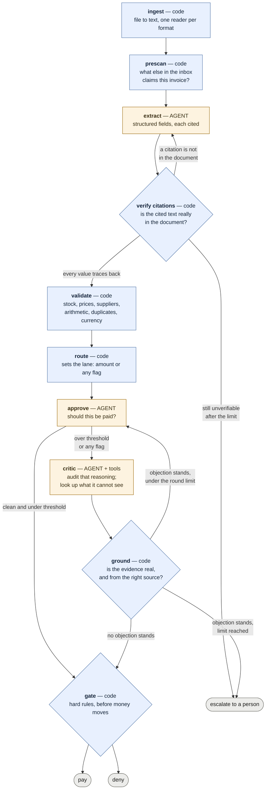

# Multi-Agent Invoice Processing

Processes vendor invoices end to end: reads whatever format the vendor sent, extracts the data
with citations, validates it against an inventory database, routes it for approval, has that
approval audited by a critic, and then pays or refuses with a recorded reason.

## The problem

Acme Corp processes vendor invoices by hand: staff read them, check items against a legacy
inventory database, chase VP approval over email, then trigger payment. It runs at a 30% error
rate with five-day delays.

Invoices arrive in whatever format the vendor sends — PDF, CSV, JSON, XML, plain text — with
typos, missing fields, impossible quantities, a currency we do not pay in, and the occasional
item that does not exist.

## What you need

| | |
|---|---|
| **Python** | 3.12 or newer |
| **[uv](https://docs.astral.sh/uv/)** | manages the virtualenv and dependencies |
| **An xAI API key** | free credits cover this; the full sample set costs well under a dollar |

Runtime dependencies are `langgraph`, `langchain-xai`, `pydantic`, `pdfplumber` and
`python-dotenv`; `pytest` for the tests. `uv sync` installs all of them.

Reading `.xlsx` or `.docx` invoices additionally needs `openpyxl` or `python-docx`. Those are
imported lazily and are not installed by default — none of the sample invoices use them, so
nobody pays for a dependency they do not need. The error message names the package if you hit
one.

## Setup

```bash
git clone https://github.com/francis-bond/multi-agent-invoice-processing
cd multi-agent-invoice-processing
uv sync
cp .env.example .env
```

Then open `.env` and put your key in `XAI_API_KEY`. Get one at
[console.x.ai](https://console.x.ai). `.env` is gitignored and nothing else in the project
reads a credential from disk.

`.env.example` documents four optional settings with working defaults: the model, the scrutiny
threshold, the currency we pay in, and the critic's round limit.

The inventory database is created and seeded on first run, so there is no separate setup step.
To reset it to its baseline stock levels:

```bash
uv run python src/inventory.py
```

## Running it

```bash
uv run python main.py --invoice_path=data/invoices/invoice_1001.txt
```

That prints the extracted invoice, every validation finding, the approval decision and its
reasoning, the critic's rounds where it ran, and what a person should do next.

Or the whole directory at once, with a summary table at the end:

```bash
uv run python main.py --all
```

Try these four to see the interesting paths:

```bash
# pays cleanly
uv run python main.py --invoice_path=data/invoices/invoice_1001.txt

# the critic overturns a rejection: a shipping line the schema used not to model
uv run python main.py --invoice_path=data/invoices/invoice_1010.txt

# a real vendor error the critic fails to talk anyone out of
uv run python main.py --invoice_path=data/invoices/invoice_1013.json

# a PDF whose text layer has OCR damage, read correctly anyway
uv run python main.py --invoice_path=data/invoices/invoice_1012.pdf
```

## When a person has to decide

An invoice the system cannot settle lands in the "needs a person" queue. Recording what they
decided is a command, and the decision is kept in the ledger database rather than the run log —
a record of who authorised a deviation from the automated controls is evidence for a payment,
so pruning logs must not prune it.

```bash
# we misread the document; the invoice itself is fine
uv run python main.py --resume 2e4c30df --resolution misread     --actor "A Name" --justification "the shipping line was on the page and we dropped it"     --set total=7185.00

# the findings are real and immaterial, and this person says so by name
uv run python main.py --resume 2e4c30df --resolution accept     --actor "A Name" --justification "WidgetC is a line we started stocking last month"     --waive item_not_found

# the invoice itself is wrong; the vendor has to send a corrected one
uv run python main.py --resume 2e4c30df --resolution vendor_reissue     --actor "A Name" --justification "their total is 50.00 over and nothing explains it"
```

There are four resolutions because "wrong" means four different things: we misread the
document, the invoice is wrong, our own records are out of date, or the findings are real and
immaterial. What is deliberately absent is a fifth option to edit the amount and pay it. Paying
250.00 against an invoice that says 2,500.00 means paying a figure no document authorises — the
vendor's receivable still says 2,500.00, nothing reconciles, and they will chase the balance. A
wrong bill is corrected by the vendor.

**An intervention supplies a better input. It never supplies the verdict.** Resolving one
produces a *new* run that goes through validation, routing, approval and the gate like any
other invoice, linked to the run it answers. If it resumed at the gate instead, a person would
become the way around every control in the system — and a person correcting one field can
easily introduce a second problem, so the controls have to see the thing that actually gets
paid. An accepted finding is shown to the approval agent as a named person's recorded decision,
which it weighs; it does not skip the agent and it does not skip the gate.

Waivers are scoped to the findings that were in front of that person. A problem appearing for
the first time on the re-run was never seen by anyone and does not inherit someone else's
approval. Some findings are not waivable at all: paying against a record of a prior payment is
not a materiality judgement, and if a further payment is owed it is owed against a new document.

## The dashboard

```bash
uv run python src/dashboard.py     # builds dashboard.html and opens it
uv run python src/logs.py          # the same record, in the terminal
```

Every run writes to `runs.db` as it happens, so the dashboard is a view over history rather
than over one invoice. It groups runs by what each one asks of a human — paid, denied, or
needs a person — with a one-line reason, the local-time timestamp, search over invoice number
and vendor, and click-through to the findings, the approval reasoning and the critic
transcript.

It is a separate command on purpose. Processing one invoice should not seize a browser window,
and the run that most needs looking at is usually not the one you just did.

## Tests

```bash
uv run python -m pytest tests/ -q
```

307 tests, under a second, no API key needed. No test calls a model and none touches `runs.db`
or `ledger.db`. CI runs them on every push with no key set, so a test that reaches for the
network fails there instead of quietly spending money.

Included are acceptance tests for the five scenarios the sample set is built around — quantity over stock,
an item stocked but empty, unknown items, a negative quantity, and an unknown `WidgetC`. Those
replay recorded extractions from `tests/fixtures/extracted/`, so the question "does this still
match what they specified?" is answered by CI. Re-record them with
`uv run python scripts/record_fixtures.py` if the extraction schema changes.

What is asserted is never a model's judgment — that is not a testable property. It is
everything the surrounding code does with the judgment: which approval lane an invoice takes,
whether an objection is grounded well enough to force a revision, when the critic loop stops,
and what survives into the final state.

## Adapting it

`MAINTENANCE.md` covers where to add products and prices, where the approved supplier list
lives, which dials change the scrutiny rules, and how to add a new validation rule so the
tests tell you what you forgot to wire up.

## Design

**Every control decision is code. Every judgment call is an agent. Nothing in between.**



Thresholds, routing, quote grounding and the pre-payment gate are deterministic. An auditor
asking why an invoice was paid gets a rule and a line number, not a model's opinion. Extraction
and approval reasoning are agents, because neither reduces to a rule.

**The catalogue holds prices, not just stock.** Nothing else in the system notices a unit
price: the arithmetic only checks the figures agree with each other, the stock check only cares
about quantity, and the approval agent has no reference price to compare against. A WidgetA
billed at 2,500.00 instead of 250.00 is internally consistent, within stock and from a known
supplier — so without an agreed price on file it would simply have been paid. Only overcharges
are flagged; a discount is the vendor's business. There is an approved supplier list for the
same reason: paying a counterparty nobody approved is the failure an accounts payable control
exists to prevent.

**The agent never picks its own lane.** Code decides whether an invoice needs scrutiny. If a
model could decide whether a control applied to it, it would not be a control.

**Every extracted value carries the verbatim text it was read from, and that text is checked
against the document.** The citation is what separates "we misread this" from "the invoice is
genuinely wrong", and those need opposite responses: the first is worth another attempt, the
second will return the same answer forever. Without the check both look like a number that does
not reconcile, and the system would either retry what can never improve or refuse invoices it
simply failed to read.

Two attempts, deliberately — one cold, one carrying the specific complaint. The only thing that
differs between attempts is the feedback, so a third would put the same complaint to the same
model at the same temperature; "what would be different?" has no good answer, and a person
reading the document does. An extraction that still cannot be traced is escalated rather than
failed, which is exactly what the `misread` resolution is for.

A bare figure is not a citation. `"0.00"` appears in plenty of documents and says nothing about
where it was read from, so the minimum length is enforced in code and the prompt asks for the
label alongside the figure. In XML or JSON a line item spans several tags, so the citation is
the whole containing element — tested, not assumed.

**The critic sees the document; the approval agent never does.** A critic given the same
evidence and asked whether it agrees will agree. This one reads the source, so it catches the
class of error the approver is structurally blind to: anything the schema failed to model.

**The critic can look things up.** It has three read-only lookups — what we have already paid
against an invoice number, an item's stock and agreed price, and whether a vendor is approved.
They exist because of a specific failure: the critic argued a duplicate payment was impossible
on the strength of the document saying nothing about one, since the ledger was invisible to it.
Now it can ask. **Tools give the agent evidence, not authority** — nothing they reach writes
anything, and every conclusion is still grounded by code and still subject to the gate.

**Code decides whether an objection counts**, on two independent questions. Every objection
must quote the document, and the quote is checked against it, so a confidently-worded invention
cannot force a revision. And the evidence has to come from the source that answers the
question: a finding read off the document must be argued from the document, and one taken from
our own records must be argued from the lookup that bears on it — which the critic has to have
actually called. A tool that exists and was not called is no better than no tool at all.

That second rule exists because of a real near miss. Validation flagged an already-paid
invoice, the critic argued the duplicate was impossible since no duplicate notice appeared in
the document and the dates "did not line up", and the approval agent was persuaded and approved
paying 5,000.00 twice. The objection was coherent and quoted the document accurately — it was
simply about something the document cannot speak to.

**The gate is a seatbelt, not a checkpoint.** It re-examines nothing and re-decides nothing. It
refuses to let certain conditions reach a transfer whatever anyone upstream concluded — and it
consults the payments ledger itself rather than trusting that nothing earlier missed a
duplicate.

It has earned its place, and it decided an open question. The gate used to refuse on absolutes
only — no total, a non-positive total, a negative quantity, an invoice already paid, an
unreconciled subtotal. An unknown item or a tenfold overcharge was none of those, on the
reasoning that materiality is a judgment call the agent owns.

That reasoning assumed the agent fails independently and rarely. It does not. Two agents
agreed with each other on a second payment of 5,000.00, and the gate caught it only because it
happens to check the ledger itself; the identical argument aimed at an unknown supplier would
have paid. So the gate now refuses anything our own records contradict — the goods, the price
or the payee — and an approval cannot waive it. Document-derived findings stay the agent's to
weigh, because it can see everything they are based on.

The dashboard marks a row where this fires **gate overrode the approval**, because an auditor
looking into a bad payment needs to see it without opening anything.

**The rest of the inbox is read before anything is processed.** The ledger catches a
superseded invoice, but only after the money has moved — in an earlier batch `invoice_1004`
was paid at 1,890.00 and its revision was then correctly refused for superseding a paid
invoice, leaving 1,890.00 to recover while the revision had been sitting in the same directory
the whole time. A regex pre-scan now groups files by invoice number first, so the older version
is held and the revision is the one that pays. Deliberately no model call: asking "is there
another file here claiming to be this invoice" does not need judgment, and paying for one per
sibling would make the check too expensive to run before every invoice. What it will not do is
guess which of two conflicting documents is correct — it says they conflict and stops.

**A failure stops the line; a finding does not.** An unreadable file or a refused extraction
means the system could not do its job, so the run ends there — one step in the log, not six
empty ones. A validation finding is the opposite: it is the thing the approval agent exists to
weigh, so it travels all the way to the gate. Short-circuiting on a finding would have left
invoice_1010 permanently denied, because its arithmetic mismatch would have ended the run
before the critic could find the shipping line that explained it.

**A deadlock is not a rejection.** When the critic and the approver cannot settle an invoice
within the round limit, it is escalated: neither paid nor refused, filed for a person with the
whole argument attached. "We could not tell" is its own answer.

The reasoning behind each of these, including the alternatives that were tried and dropped, is
in the commit messages — they are written to be read.

## What was cut, and why

- **Human-in-the-loop approval via `interrupt()`.** LangGraph was chosen partly for its
  checkpointing, and a real VP approval would need it. Approval here is *simulated*, so the
  checkpointing argument stops being load-bearing and building it would have been architecture
  for a requirement that does not exist.
- **A fuzzy-matching agent for item names.** Cut as process theatre. The actual problem was
  spelling variants, and `Widget A` → `WidgetA` is an exact match after a declared transform,
  not a judgment call. It is code, and it reports which stage matched.
- **Currency conversion.** Deliberate. See known gaps.
- **A `DECISIONS.md`.** The rationale lives in the commit messages next to the code it
  explains, which cannot drift from it.

## Known gaps

- **The gate does not block unknown items, overcharges or unapproved suppliers.** It refuses on absolutes only. If the
  approval agent ever approved an invoice for an item we do not stock, the payment would go
  through — in practice it rejects all of them. Whether materiality there is the agent's call
  or the gate's is an open design question, and `tests/test_acceptance.py` marks it `xfail`
  rather than hiding it.
- **Cross-format invoices are not compared field by field.** When two files claim the same
  invoice number, the pre-scan compares their stated totals by regex and flags a mismatch for
  a person. It does not extract both and reconcile them line by line, which would cost a model
  call per sibling on every run.
- **Scanned PDFs are refused, not read.** No OCR. The reader distinguishes a scan from a blank
  document and says which, because those need different responses.
- **Currency is caught, never converted.** An invoice in another currency goes to a person. A
  conversion needs a rate source, a rate date — invoice date and payment date are different
  numbers and different audit answers — and a policy on who bears the spread. Without those,
  converting would mean putting a number nobody can defend into a payments record.

## Test data

`data/invoices/` holds 20 sample files, committed so the repo runs standalone.
They deliberately include broken cases: quantities over stock, unknown items, a negative
quantity, duplicated invoice numbers, a revision of an invoice that was already paid, a
`field,value` CSV that collapses its line items under naive parsing, an invoice in EUR, and a
PDF whose text layer writes a capital `O` where a zero belongs.

Three databases, all gitignored so everyone builds their own:

| | |
|---|---|
| `inventory.db` | the mock catalogue and its stock levels |
| `runs.db` | observability. Useful, and disposable |
| `ledger.db` | the record of money that has left the account. Separate on purpose, so a decision to prune logs can never delete it |
