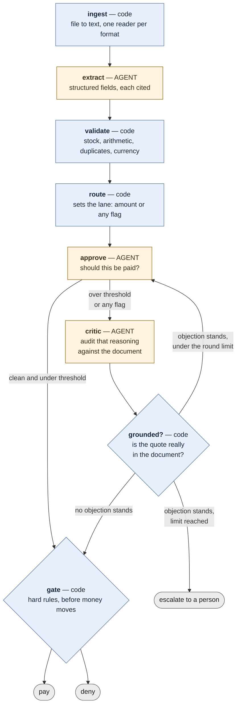

# Multi-Agent Invoice Processing

Processes vendor invoices end to end: reads whatever format the vendor sent, extracts the data
with citations, validates it against an inventory database, routes it for approval, has that
approval audited by a critic, and then pays or refuses with a recorded reason.

## The problem

Acme Corp processes vendor invoices by hand: staff read them, check items against a legacy
inventory database, chase VP approval over email, then trigger payment. It runs at a 30% error
rate with five-day delays.

Invoices arrive in whatever format the vendor sends — PDF, CSV, JSON, XML, plain text — with
typos, missing fields, impossible quantities, a currency we do not pay in, and the occasional
item that does not exist.

## What you need

| | |
|---|---|
| **Python** | 3.12 or newer |
| **[uv](https://docs.astral.sh/uv/)** | manages the virtualenv and dependencies |
| **An xAI API key** | free credits cover this; the full sample set costs well under a dollar |

Runtime dependencies are `langgraph`, `langchain-xai`, `pydantic`, `pdfplumber` and
`python-dotenv`; `pytest` for the tests. `uv sync` installs all of them.

Reading `.xlsx` or `.docx` invoices additionally needs `openpyxl` or `python-docx`. Those are
imported lazily and are not installed by default — none of the sample invoices use them, so
nobody pays for a dependency they do not need. The error message names the package if you hit
one.

## Setup

```bash
git clone https://github.com/francis-bond/multi-agent-invoice-processing
cd multi-agent-invoice-processing
uv sync
cp .env.example .env
```

Then open `.env` and put your key in `XAI_API_KEY`. Get one at
[console.x.ai](https://console.x.ai). `.env` is gitignored and nothing else in the project
reads a credential from disk.

`.env.example` documents four optional settings with working defaults: the model, the scrutiny
threshold, the currency we pay in, and the critic's round limit.

The inventory database is created and seeded on first run, so there is no separate setup step.
To reset it to its baseline stock levels:

```bash
uv run python src/inventory.py
```

## Running it

```bash
uv run python main.py --invoice_path=data/invoices/invoice_1001.txt
```

That prints the extracted invoice, every validation finding, the approval decision and its
reasoning, the critic's rounds where it ran, and what a person should do next.

Try these four to see the interesting paths:

```bash
# pays cleanly
uv run python main.py --invoice_path=data/invoices/invoice_1001.txt

# the critic overturns a rejection: a shipping line the schema used not to model
uv run python main.py --invoice_path=data/invoices/invoice_1010.txt

# a real vendor error the critic fails to talk anyone out of
uv run python main.py --invoice_path=data/invoices/invoice_1013.json

# a PDF whose text layer has OCR damage, read correctly anyway
uv run python main.py --invoice_path=data/invoices/invoice_1012.pdf
```

## The dashboard

```bash
uv run python src/dashboard.py     # builds dashboard.html and opens it
uv run python src/logs.py          # the same record, in the terminal
```

Every run writes to `runs.db` as it happens, so the dashboard is a view over history rather
than over one invoice. It groups runs by what each one asks of a human — paid, denied, or
needs a person — with a one-line reason, the local-time timestamp, search over invoice number
and vendor, and click-through to the findings, the approval reasoning and the critic
transcript.

It is a separate command on purpose. Processing one invoice should not seize a browser window,
and the run that most needs looking at is usually not the one you just did.

## Tests

```bash
uv run python -m pytest tests/ -q
```

166 tests plus 4 marking an open design question, under a second, no API key needed. No test calls a model and none touches `runs.db`
or `ledger.db`. CI runs them on every push with no key set, so a test that reaches for the
network fails there instead of quietly spending money.

Included are acceptance tests for the five scenarios the sample set is built around — quantity over stock,
an item stocked but empty, unknown items, a negative quantity, and an unknown `WidgetC`. Those
replay recorded extractions from `tests/fixtures/extracted/`, so the question "does this still
match what they specified?" is answered by CI. Re-record them with
`uv run python scripts/record_fixtures.py` if the extraction schema changes.

What is asserted is never a model's judgment — that is not a testable property. It is
everything the surrounding code does with the judgment: which approval lane an invoice takes,
whether an objection is grounded well enough to force a revision, when the critic loop stops,
and what survives into the final state.

## Design

**Every control decision is code. Every judgment call is an agent. Nothing in between.**



Thresholds, routing, quote grounding and the pre-payment gate are deterministic. An auditor
asking why an invoice was paid gets a rule and a line number, not a model's opinion. Extraction
and approval reasoning are agents, because neither reduces to a rule.

**The catalogue holds prices, not just stock.** Nothing else in the system notices a unit
price: the arithmetic only checks the figures agree with each other, the stock check only cares
about quantity, and the approval agent has no reference price to compare against. A WidgetA
billed at 2,500.00 instead of 250.00 is internally consistent, within stock and from a known
supplier — so without an agreed price on file it would simply have been paid. Only overcharges
are flagged; a discount is the vendor's business. There is an approved supplier list for the
same reason: paying a counterparty nobody approved is the failure an accounts payable control
exists to prevent.

**The agent never picks its own lane.** Code decides whether an invoice needs scrutiny. If a
model could decide whether a control applied to it, it would not be a control.

**Every extracted value carries the verbatim text it was read from.** That citation is what
separates "the extractor misread this" from "the invoice is genuinely wrong" — the first is
worth retrying, the second never will be.

**The critic sees the document; the approval agent never does.** A critic given the same
evidence and asked whether it agrees will agree. This one reads the source, so it catches the
class of error the approver is structurally blind to: anything the schema failed to model.

**Code decides whether an objection counts**, on two independent questions. Every objection
must quote the document, and the quote is checked against it, so a confidently-worded invention
cannot force a revision. And every finding is labelled with where its facts came from: a
finding read off the document is the critic's to argue with, while one looked up in our own
records — payment history, catalogue, supplier list — is not, because none of that is in the
invoice and the document's silence about it proves nothing.

That second rule exists because of a real near miss. Validation flagged an already-paid
invoice, the critic argued the duplicate was impossible since no duplicate notice appeared in
the document and the dates "did not line up", and the approval agent was persuaded and approved
paying 5,000.00 twice. The objection was coherent and quoted the document accurately — it was
simply about something the document cannot speak to.

**The gate is a seatbelt, not a checkpoint.** It re-examines nothing and re-decides nothing. It
refuses to let certain conditions reach a transfer whatever anyone upstream concluded — and it
consults the payments ledger itself rather than trusting that nothing earlier missed a
duplicate.

It has earned its place, and it decided an open question. The gate used to refuse on absolutes
only — no total, a non-positive total, a negative quantity, an invoice already paid, an
unreconciled subtotal. An unknown item or a tenfold overcharge was none of those, on the
reasoning that materiality is a judgment call the agent owns.

That reasoning assumed the agent fails independently and rarely. It does not. Two agents
agreed with each other on a second payment of 5,000.00, and the gate caught it only because it
happens to check the ledger itself; the identical argument aimed at an unknown supplier would
have paid. So the gate now refuses anything our own records contradict — the goods, the price
or the payee — and an approval cannot waive it. Document-derived findings stay the agent's to
weigh, because it can see everything they are based on.

The dashboard marks a row where this fires **gate overrode the approval**, because an auditor
looking into a bad payment needs to see it without opening anything.

**A failure stops the line; a finding does not.** An unreadable file or a refused extraction
means the system could not do its job, so the run ends there — one step in the log, not six
empty ones. A validation finding is the opposite: it is the thing the approval agent exists to
weigh, so it travels all the way to the gate. Short-circuiting on a finding would have left
invoice_1010 permanently denied, because its arithmetic mismatch would have ended the run
before the critic could find the shipping line that explained it.

**A deadlock is not a rejection.** When the critic and the approver cannot settle an invoice
within the round limit, it is escalated: neither paid nor refused, filed for a person with the
whole argument attached. "We could not tell" is its own answer.

The reasoning behind each of these, including the alternatives that were tried and dropped, is
in the commit messages — they are written to be read.

## What was cut, and why

- **Human-in-the-loop approval via `interrupt()`.** LangGraph was chosen partly for its
  checkpointing, and a real VP approval would need it. Approval here is *simulated*, so the
  checkpointing argument stops being load-bearing and building it would have been architecture
  for a requirement that does not exist.
- **A fuzzy-matching agent for item names.** Cut as process theatre. The actual problem was
  spelling variants, and `Widget A` → `WidgetA` is an exact match after a declared transform,
  not a judgment call. It is code, and it reports which stage matched.
- **Currency conversion.** Deliberate. See known gaps.
- **A `DECISIONS.md`.** The rationale lives in the commit messages next to the code it
  explains, which cannot drift from it.

## Known gaps

- **The gate does not block unknown items, overcharges or unapproved suppliers.** It refuses on absolutes only. If the
  approval agent ever approved an invoice for an item we do not stock, the payment would go
  through — in practice it rejects all of them. Whether materiality there is the agent's call
  or the gate's is an open design question, and `tests/test_acceptance.py` marks it `xfail`
  rather than hiding it.
- **No extraction self-correction loop.** The citation-driven retry is designed and not built:
  when a figure's citation is missing or does not match the document, that is a misread worth
  retrying, as distinct from an invoice that is genuinely wrong. The approval critic loop is
  built; this second one is not.
- **No inbox pre-scan.** A revision that supersedes an unpaid invoice is only caught after the
  earlier one is paid, by the ledger. Scanning the inbox before processing would prevent the
  wrong payment instead of detecting it.
- **Scanned PDFs are refused, not read.** No OCR. The reader distinguishes a scan from a blank
  document and says which, because those need different responses.
- **Currency is caught, never converted.** An invoice in another currency goes to a person. A
  conversion needs a rate source, a rate date — invoice date and payment date are different
  numbers and different audit answers — and a policy on who bears the spread. Without those,
  converting would mean putting a number nobody can defend into a payments record.

## Test data

`data/invoices/` holds 20 sample files, committed so the repo runs standalone.
They deliberately include broken cases: quantities over stock, unknown items, a negative
quantity, duplicated invoice numbers, a revision of an invoice that was already paid, a
`field,value` CSV that collapses its line items under naive parsing, an invoice in EUR, and a
PDF whose text layer writes a capital `O` where a zero belongs.

Three databases, all gitignored so everyone builds their own:

| | |
|---|---|
| `inventory.db` | the mock catalogue and its stock levels |
| `runs.db` | observability. Useful, and disposable |
| `ledger.db` | the record of money that has left the account. Separate on purpose, so a decision to prune logs can never delete it |
